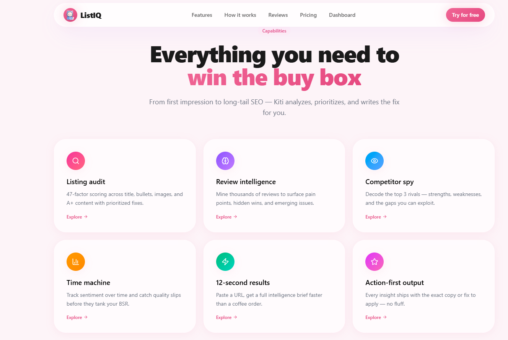
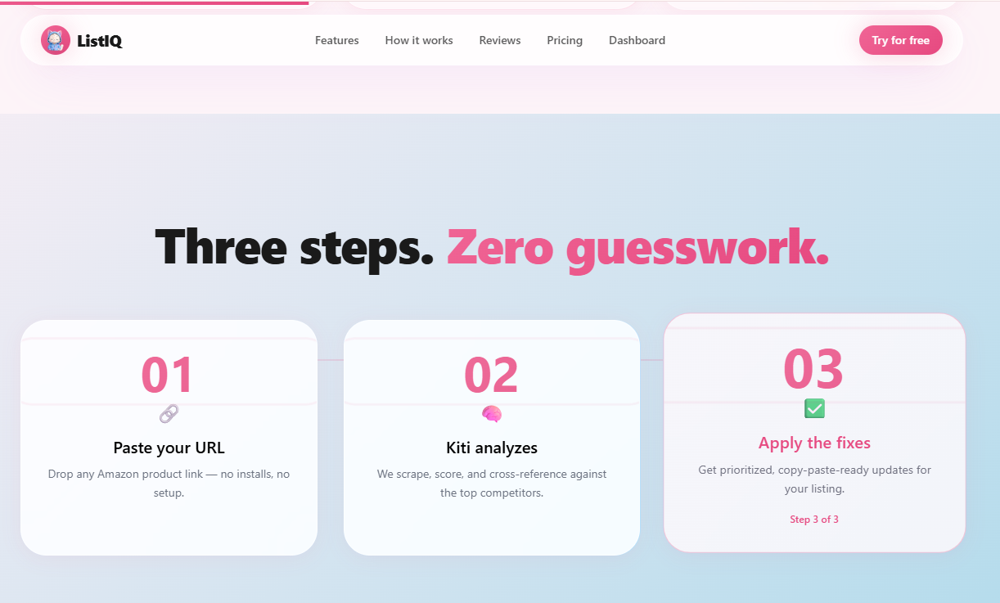
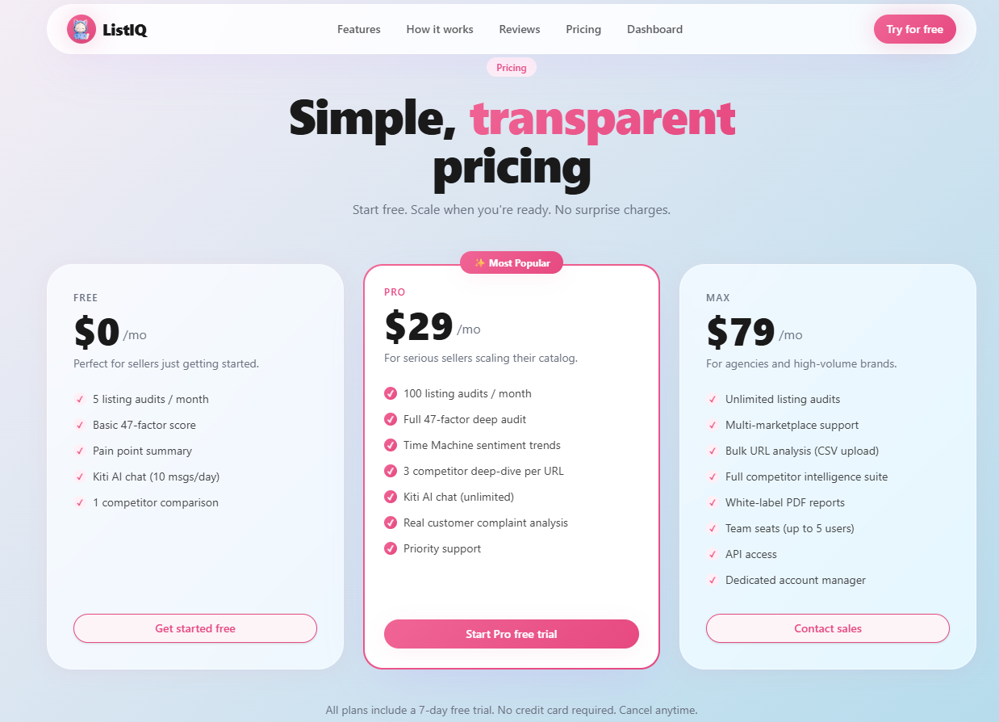
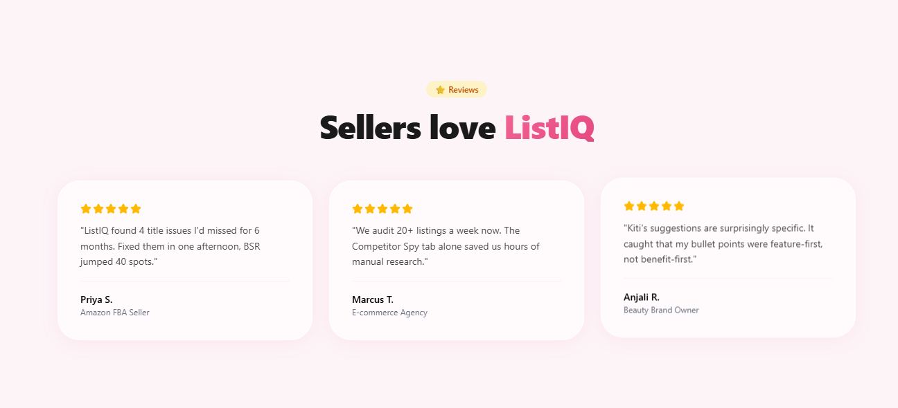
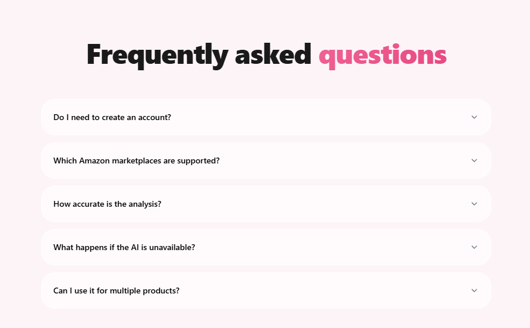
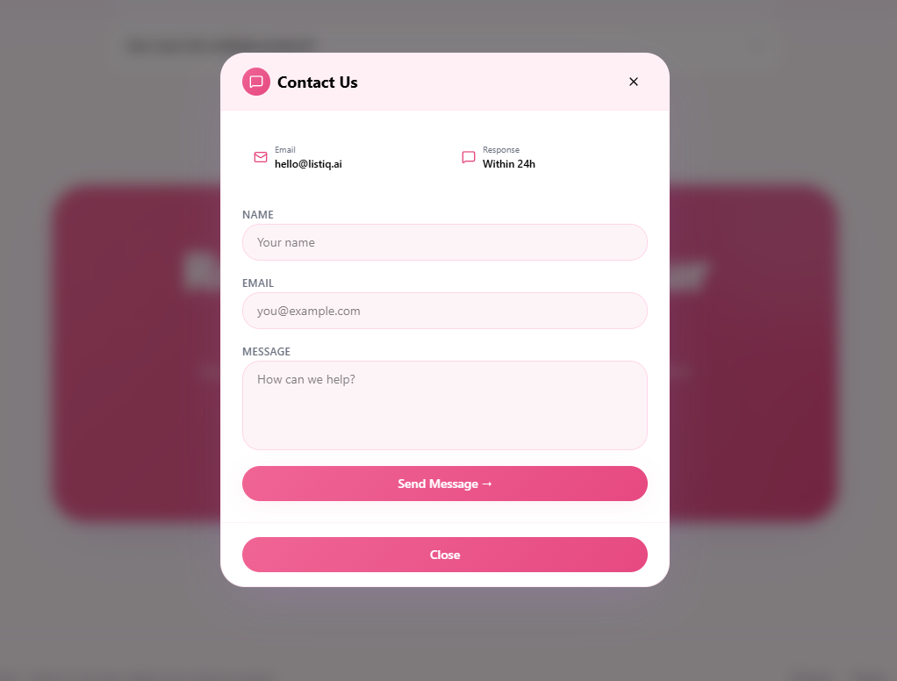
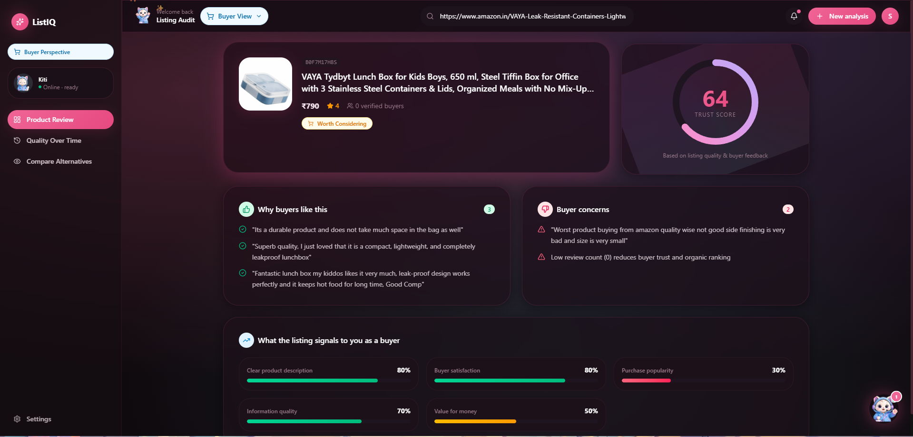
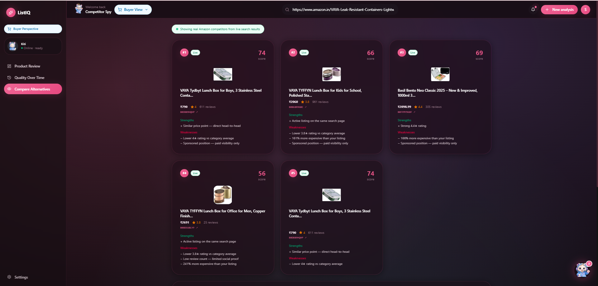
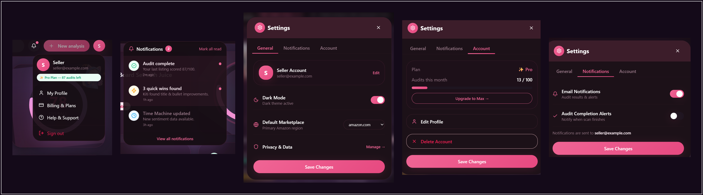

<div align="center">


<br/><br/>

# 🐱 &nbsp; L I S T I Q

### *Amazon Listing Intelligence, Powered by AI*

<p>Paste any Amazon URL · Get an instant audit score · Real buyer sentiment · Competitor gaps · Ranked fix-plan</p>

<br/>

<a href="https://react.dev"></a>
<a href="https://www.typescriptlang.org"></a>
<a href="https://vitejs.dev"></a>
<a href="https://expressjs.com"></a>
<a href="https://tailwindcss.com"></a>
<a href="https://www.framer.com/motion/"></a>

<br/><br/>


&nbsp;

&nbsp;


</div>

---

<br/>

## 📖 Table of Contents

| | Section |
|:--|:--|
| 🌟 | [Overview](#-overview) |
| 📸 | [Screenshots](#-screenshots) |
| ✨ | [Features](#-features) |
| ⚡ | [How It Works](#-how-it-works) |
| 🗂️ | [Project Structure](#️-project-structure) |
| 🛠️ | [Tech Stack](#️-tech-stack) |
| 🚀 | [Getting Started](#-getting-started) |
| 🔑 | [Environment Variables](#-environment-variables) |
| 🔌 | [API Reference](#-api-reference) |
| 🐱 | [Kiti Intent Engine](#-kiti--the-intent-engine) |
| 🌐 | [Supported Marketplaces](#-supported-amazon-marketplaces) |
| 🗺️ | [Roadmap](#️-roadmap) |
| 🤝 | [Contributing](#-contributing) |

<br/>

---

## 🌟 Overview

**ListIQ** is a full-stack SaaS intelligence tool built for Amazon sellers and smart shoppers.

In seconds it fetches live product data, scores the listing across **5 performance pillars**, surfaces **real buyer complaints** extracted from 1–2★ reviews, and generates a **prioritized fix plan**. The entire experience is guided by **Kiti** — a friendly AI co-pilot with a 20-intent engine that answers everything from BSR and A9 to PPC, A+ content, keyword gaps and more.

> **No fluff. No generic advice. Just real data, about the real product.**

### 🎯 &nbsp; Who Is This For?

| Audience | What ListIQ Does For You |
|:--|:--|
| 🏪 **Amazon Sellers** | Audit your listing, find conversion leaks, get a ranked fix plan |
| 🛍️ **Smart Shoppers** | Evaluate products before buying — see what real buyers complain about |
| 📈 **Brand Managers** | Track competitor gaps, monitor sentiment trends over time |
| 🎓 **E-commerce Students** | Learn A9, BSR, PPC, A+ content from Kiti's built-in knowledge engine |

<br/>

---

## 📸 Screenshots

<br/>

### 🏠 &nbsp; Landing Page

<<div align="center">

<h3>🌞 Light & 🌙 Dark Mode</h3>


---

### ✨ Features Section

<div align="center">

</div>

---

### 🧠 How It Works

<div align="center">

</div>

---

### 💰 Pricing

<div align="center">

</div>

---

### ❤️ Reviews

<div align="center">

</div>

---

### ❓ FAQ

<div align="center">

</div>

---

### 📩 Contact

<div align="center">

</div>

---


<br/>

> *Clean, dark hero with the Kiti mascot, URL input bar, and live audit preview card. Glassmorphism elements and glowing particle effects create a premium first impression.*

<br/>

---

### 📊 &nbsp; Listing Audit Dashboard

### 📊 Seller Audit Dashboard

<div align="center">

</div>

---

### 🛍️ Buyer Audit View

<div align="center">

</div>

---

<br/>

> *Animated score ring (78/100), factor breakdown with color-coded metric bars, real buyer pain points extracted from reviews, and a "What's Working" panel — all on one screen. The sidebar shows Kiti's online status and navigation to all tabs.*

<br/>

---

### ⏳ &nbsp; Time Machine — Sentiment Timeline

### ⏳ Time Machine (Buyer)

<div align="center">

</div>


<br/>

> *Sentiment trend area chart showing positive (green) vs negative (red) buyer perception over 7 months. Below: emerging complaints with percentage spikes (+340% "Warping after dishwasher") and an AI summary with suggested listing updates.*

<br/>

---

### 🕵️ &nbsp; Competitor Spy

### 🕵️ Competitor Spy (Seller)

<div align="center">

</div>

---

### 🛒 Competitor Spy (Buyer)

<div align="center">

</div>

<br/>

> *Side-by-side competitor comparison cards showing scores (#1 at 84, #2 at 72, #3 at 79), pricing, review counts, strengths and weaknesses for each rival. Below: a bar chart for visual score comparison across all competitors.*

<br/>

---

### 🐱 &nbsp; Kiti AI Assistant

<div align="center">

</div>

---
<div align="center">

</div>


<br/>

> *Kiti's floating chat panel with her avatar, greeting message, and contextual product advice. The input field accepts Amazon URLs for product-specific Q&A. She understands 20+ intents natively — no API key required.*

<br/>

---

## ✨ Features

<br/>

<table>
<tr>
<td width="50%" valign="top">

### 🔬 &nbsp; Listing Audit
- **0–100 overall score** — animated gradient ring
- Verdict label — `Strong` · `Needs Work` · `Poor`
- **7 scored factors** — Title, Bullets, Images, A+ Content, Review Sentiment, Pricing, BSR
- **Pain Points** — real complaint sentences from 1–2★ reviews
- **What's Working** — praise phrases from 4–5★ reviews
- **Ranked Fix Plan** — sorted by conversion impact

</td>
<td width="50%" valign="top">

### 🛒 &nbsp; Dual Perspective Mode
- **Seller View** — optimize for ranking & conversion
- **Buyer View** — evaluate before purchasing
- One-click toggle with context-aware UI
- Each tab adjusts its language and metrics accordingly

</td>
</tr>
<tr>
<td width="50%" valign="top">

### 🕵️ &nbsp; Competitor Spy
- Side-by-side ASIN comparisons (up to 3 rivals)
- Rating · reviews · price · feature gap analysis
- Strengths / Weaknesses breakdown per competitor
- Score comparison bar chart
- Glassmorphism product cards with brand highlights

</td>
<td width="50%" valign="top">

### ⏳ &nbsp; Time Machine
- Sentiment trend chart across 7 months
- Track buyer perception shifts over time
- **Emerging complaints** with spike percentages
- **AI Summary** with root cause analysis
- Suggested listing updates based on trends

</td>
</tr>
<tr>
<td width="50%" valign="top">

### 🐱 &nbsp; Kiti — AI Co-pilot
- **20+ recognized intents** (BSR, Vine, PPC, A9 & more)
- Answers grounded in the **actual analyzed product**
- OpenAI-powered with a rich **local fallback engine**
- Animated mascot — greeting · analyzing · idle states
- Floating chat panel with markdown rendering

</td>
<td width="50%" valign="top">

### 🌍 &nbsp; Real Amazon Data
- Live data via **Rainforest API**
- Auto-detects marketplace & currency from URL
- Supports **10 Amazon marketplaces** worldwide
- Extracts real complaint/praise sentences from reviews
- Smart **mock fallback** — works without an API key

</td>
</tr>
</table>

<div align="center">

</div>
<br/>

---

## ⚡ How It Works

```
  ┌──────────────────────────────────────────────────────────────┐
  │                         USER FLOW                            │
  ├──────────────────────────────────────────────────────────────┤
  │                                                              │
  │   1. Paste Amazon URL  ──►  2. Click Analyze                 │
  │                                        │                     │
  │                ┌───────────────────────▼──────────────┐      │
  │                │  Rainforest API  (live Amazon data)  │      │
  │                │  OR  Mock Fallback  (no key needed)  │      │
  │                └───────────────────────┬──────────────┘      │
  │                                        │                     │
  │          ┌─────────────────────────────▼──────────────────┐  │
  │          │      Analysis Engine  (AI + Local Rules)       │  │
  │          │   · Score 7 factors    · Extract complaints    │  │
  │          │   · Identify praises   · Generate fix plan     │  │
  │          └────────────────┬─────────────────┬─────────────┘  │
  │                           │                 │                │
  │               ┌───────────▼──────┐  ┌───────▼──────┐         │
  │               │   Dashboard UI   │  │  Kiti Chat   │         │
  │               │  Score · Audit   │  │  20+ Intents │         │
  │               │  Competitor Spy  │  │  + OpenAI    │         │
  │               │  Time Machine    │  └──────────────┘         │
  │               └──────────────────┘                           │
  └──────────────────────────────────────────────────────────────┘
```
<div align="center">

</div>

---

<br/>

---

## 🗂️ Project Structure

```
ListIQ/
│
├── 📄 start.bat                     # One-click dev launcher (Windows)
├── 📄 package.json                  # Root — runs both servers concurrently
├── 📁 assets/                       # README images & screenshots
│
├── 🎨 frontend/                     # React 19 · TanStack Start · Tailwind 4
│   └── src/
│       ├── routes/
│       │   ├── index.tsx            # Landing page with hero & URL input
│       │   └── dashboard.tsx        # Main dashboard + URL analyzer
│       │
│       ├── components/
│       │   ├── FloatingAssistant.tsx    # Kiti floating chat bubble
│       │   ├── KitiMascot.tsx           # Animated SVG mascot
│       │   ├── Sidebar.tsx              # Navigation sidebar
│       │   ├── Navbar.tsx               # Top navigation bar
│       │   ├── Hero.tsx                 # Landing hero section
│       │   ├── GlassCard.tsx            # Glassmorphism card
│       │   ├── ScoreRing.tsx            # Animated SVG score ring
│       │   └── MetricBar.tsx            # Animated metric bar
│       │
│       ├── tabs/
│       │   ├── AuditTab.tsx             # Seller listing audit
│       │   ├── BuyerAuditTab.tsx        # Buyer evaluation view
│       │   ├── CompetitorSpyTab.tsx     # Competitor comparison
│       │   └── TimeMachineTab.tsx       # Sentiment timeline
│       │
│       └── services/
│           └── api.ts                   # Typed Axios API client
│
└── ⚙️  backend/                      # Node.js · Express 5
    └── src/
        ├── routes/api.routes.js     # /analyze · /timeline · /competitors · /chat
        ├── controllers/             # Thin request handlers
        ├── services/
        │   ├── analyze.service.js   # Core analysis orchestrator
        │   ├── chat.service.js      # Kiti intent engine + OpenAI
        │   ├── competitor.service.js # Rival ASIN comparison
        │   └── timeline.service.js  # Sentiment trend builder
        ├── providers/
        │   ├── rainforest.js        # Rainforest API + mock fallback
        │   ├── ai.js                # OpenAI wrapper
        │   └── localAnalysis.js     # Rule-based offline engine
        ├── middlewares/             # Error handling · Helmet
        ├── validations/             # Zod request schemas
        └── config/                  # Environment config loader
```

<br/>

---

## 🛠️ Tech Stack

| Layer | Technology | Purpose |
|:--|:--|:--|
| **UI Framework** | React 19 | Component model, concurrent rendering |
| **App Framework** | TanStack Start | SSR-ready, file-based routing |
| **Language** | TypeScript 5.8 | End-to-end type safety |
| **Styling** | Tailwind CSS v4 | Utility-first + custom CSS design tokens |
| **Animations** | Framer Motion 12 | Micro-interactions, page transitions, mascot states |
| **Charts** | Recharts 3 | Sentiment timeline & score comparison charts |
| **UI Primitives** | Radix UI + shadcn/ui | Accessible, headless components |
| **Forms** | React Hook Form + Zod | Type-safe validation |
| **Build Tool** | Vite 7 | Lightning-fast dev server & bundler |
| **Backend** | Node.js + Express 5 | REST API server |
| **Validation** | Zod | Request schema enforcement |
| **Amazon Data** | Rainforest API | Live product data + review extraction |
| **AI** | OpenAI API | GPT-powered Kiti responses (optional) |
| **Security** | Helmet.js + CORS | HTTP security headers |

<br/>

---

## 🚀 Getting Started

### Prerequisites

| Requirement | Version | Notes |
|:--|:--|:--|
| [Node.js](https://nodejs.org) | v18+ | Required |
| npm | v9+ | Comes with Node.js |
| [Rainforest API Key](https://www.rainforestapi.com/) | — | Optional — mock data works without it |
| [OpenAI API Key](https://platform.openai.com/) | — | Optional — local engine works without it |

<br/>

### Step 1 &nbsp;·&nbsp; Clone

```bash
git clone https://github.com/Anjali15-rawat/ListIQ.git
cd ListIQ
```

### Step 2 &nbsp;·&nbsp; Install Dependencies

```bash
# Install all dependencies (root + frontend + backend)
npm install
npm install --prefix frontend
npm install --prefix backend
```

### Step 3 &nbsp;·&nbsp; Configure Environment

Create the following `.env` files:

**`backend/.env`**
```env
PORT=5000
RAINFOREST_API_KEY=your_key_here      # Optional
OPENAI_API_KEY=your_key_here          # Optional
```

**`frontend/.env`**
```env
VITE_API_URL=http://localhost:5000
```

> 💡 **Both API keys are optional.** Without `RAINFOREST_API_KEY`, realistic mock data is used. Without `OPENAI_API_KEY`, Kiti runs its built-in 20+ intent engine — no functionality lost.

### Step 4 &nbsp;·&nbsp; Start the App

**Windows (one-click):**
```bash
.\start.bat
```

**Any platform:**
```bash
npm run dev    # Starts frontend + backend together via concurrently
```

**Individually:**
```bash
cd backend  && npm run dev    # → http://localhost:5000
cd frontend && npm run dev    # → http://localhost:5173
```

### Step 5 &nbsp;·&nbsp; Open in Browser

| | URL |
|:--|:--|
| 🏠 Landing Page | `http://localhost:5173` |
| 📊 Dashboard | `http://localhost:5173/dashboard` |
| 🔌 API Base | `http://localhost:5000/api` |
| ✅ Health Check | `http://localhost:5000/api/test` |

<br/>

---

## 🔑 Environment Variables

### Backend — `backend/.env`

| Variable | Required | Default | Description |
|:--|:--|:--|:--|
| `PORT` | No | `5000` | Server port |
| `RAINFOREST_API_KEY` | No | — | Live Amazon data — [get free key](https://www.rainforestapi.com/) |
| `OPENAI_API_KEY` | No | — | GPT-powered Kiti — [get key](https://platform.openai.com/) |

### Frontend — `frontend/.env`

| Variable | Required | Default | Description |
|:--|:--|:--|:--|
| `VITE_API_URL` | Yes | — | Backend base URL (e.g. `http://localhost:5000`) |

<br/>

---

## 🔌 API Reference

**Base URL:** `http://localhost:5000/api`

<br/>

### `GET /test` &nbsp;—&nbsp; Health Check

```json
{ "message": "API working ✅" }
```

---

### `POST /analyze` &nbsp;—&nbsp; Full Listing Audit

<details>
<summary>📋 &nbsp; View Request / Response</summary>

```json
// Request
{ "url": "https://www.amazon.in/dp/B0XXXXXXXXX" }

// Response
{
  "overallScore": 78,
  "verdict": "Needs Work",
  "factors": [
    { "factor": "Title optimization",  "score": 82, "reason": "Good keyword placement" },
    { "factor": "Bullet points",       "score": 71, "reason": "Missing benefit-driven language" },
    { "factor": "Image quality",       "score": 88, "reason": "Strong lifestyle imagery" },
    { "factor": "A+ content",          "score": 54, "reason": "No A+ content detected" },
    { "factor": "Review sentiment",    "score": 76, "reason": "12% negative sentiment rate" },
    { "factor": "Pricing",             "score": 85, "reason": "Competitive in category" }
  ],
  "painPoints":   ["12% of reviews mention warping after dishwasher use",
                    "Customers expect oil included — not in package"],
  "whatsWorking": ["Juice groove highlighted heavily — drives 34% of positive mentions",
                    "Gift packaging praised in 18% of 5-star reviews"],
  "fixes":        ["Add dishwasher care instructions to bullet #1",
                    "Include mineral oil in package or set expectations"],
  "product": {
    "title": "Premium Bamboo Cutting Board Set with Juice Groove (3-Piece)",
    "price": 34.99,
    "currency": { "symbol": "$", "code": "USD" },
    "rating": 4.3,
    "reviewsCount": 2847,
    "asin": "B0CXY12345",
    "bsr": "#142 in Kitchen"
  }
}
```

</details>

---

### `POST /chat` &nbsp;—&nbsp; Kiti Conversation

<details>
<summary>📋 &nbsp; View Request / Response</summary>

```json
// Request
{
  "message": "What are buyers complaining about?",
  "url": "https://www.amazon.in/dp/B0XXXXXXXXX"
}

// Response
{
  "reply": "Real complaints from buyers of **\"Premium Bamboo Cutting Board…\"**:\n\n• *\"12% mention warping after dishwasher use\"*\n• *\"Customers expect oil included\"*\n\n💡 Address these in your bullet points — buyers read negatives before buying."
}
```

</details>

---

### `POST /timeline` &nbsp;—&nbsp; Sentiment Timeline

<details>
<summary>📋 &nbsp; View Request / Response</summary>

```json
// Request
{ "url": "https://www.amazon.in/dp/B0XXXXXXXXX" }

// Response
{
  "timeline": [
    { "month": "Jun", "positive": 78, "negative": 14 },
    { "month": "Jul", "positive": 75, "negative": 12 },
    { "month": "Aug", "positive": 72, "negative": 18 }
  ],
  "emergingComplaints": [
    { "complaint": "Warping after dishwasher", "change": "+340%" },
    { "complaint": "Small board too thin",     "change": "+120%" }
  ],
  "aiSummary": "Negative sentiment spiked in Sept-Oct around durability concerns."
}
```

</details>

---

### `POST /competitors` &nbsp;—&nbsp; Competitor Analysis

<details>
<summary>📋 &nbsp; View Request / Response</summary>

```json
// Request
{ "url": "https://www.amazon.in/dp/B0XXXXXXXXX" }

// Response
{
  "competitors": [
    {
      "rank": 1,
      "name": "BambooMax Pro Set",
      "price": 29.99,
      "rating": 4.5,
      "reviewsCount": 5120,
      "score": 84,
      "strengths": ["Lower price point", "Includes mineral oil"],
      "weaknesses": ["No juice groove on small board"]
    }
  ]
}
```

</details>

<br/>

---

## 🐱 Kiti — The Intent Engine

Kiti understands **20+ intents natively** — no OpenAI key required. With a key, she falls back to GPT for fully dynamic, personalized responses.

| Intent | Example Triggers | What Kiti Does |
|:--|:--|:--|
| `greet` | *"hi", "hello", "hey"* | Welcomes and offers help |
| `rating` | *"how's my rating?"* | Analyzes rating vs category threshold |
| `reviews` | *"what are buyers saying?"* | Surfaces real complaint sentences |
| `price` | *"is my price competitive?"* | Compares against competitors |
| `title` | *"how's my title?"* | Checks keyword placement & length |
| `bullets` | *"how do I improve bullets?"* | Suggests benefit-driven rewrites |
| `images` | *"how many images?"* | Recommends image strategy |
| `keywords` | *"what keywords am I missing?"* | SEO gap analysis |
| `competitor` | *"who are my rivals?"* | Pulls competitor data |
| `ads` | *"how do I run PPC?"* | PPC / ACOS guidance |
| `score` | *"what's my overall score?"* | Explains the audit score |
| `improve` | *"what should I fix first?"* | Prioritized fix plan |
| `shipping` | *"FBA vs FBM?"* | Fulfillment advice |
| `aplus` | *"what is A+ content?"* | Brand registry guidance |
| `returns` | *"how do I reduce returns?"* | Return rate optimization |
| `sales` | *"how do I win the Buy Box?"* | Buy Box strategy |
| `explain_bsr` | *"what is BSR?"* | Best Seller Rank explained |
| `explain_algo` | *"how does Amazon rank?"* | A9 algorithm breakdown |
| `explain_vine` | *"what is Amazon Vine?"* | Early review program info |

<br/>

---

## 🌐 Supported Amazon Marketplaces

ListIQ auto-detects the marketplace from the URL — no manual configuration needed.

| Flag | Marketplace | Domain | Currency |
|:--|:--|:--|:--|
| 🇺🇸 | USA | `amazon.com` | $ USD |
| 🇮🇳 | India | `amazon.in` | ₹ INR |
| 🇬🇧 | UK | `amazon.co.uk` | £ GBP |
| 🇩🇪 | Germany | `amazon.de` | € EUR |
| 🇫🇷 | France | `amazon.fr` | € EUR |
| 🇪🇸 | Spain | `amazon.es` | € EUR |
| 🇮🇹 | Italy | `amazon.it` | € EUR |
| 🇯🇵 | Japan | `amazon.co.jp` | ¥ JPY |
| 🇨🇦 | Canada | `amazon.ca` | CA$ CAD |
| 🇦🇺 | Australia | `amazon.com.au` | A$ AUD |

<br/>

---

## 🗺️ Roadmap

| Status | Feature |
|:--|:--|
| ✅ Done | Core listing audit (AI + local rules) |
| ✅ Done | Kiti AI assistant (20+ intents) |
| ✅ Done | Dual perspective — Seller / Buyer |
| ✅ Done | Competitor Spy tab |
| ✅ Done | Time Machine sentiment timeline |
| ✅ Done | 10 Amazon marketplace support |
| ✅ Done | Mock fallback (no API key needed) |
| ✅ Done | Premium dark-mode landing page |
| 🔜 Next | User auth & saved audit history |
| 🔜 Next | Batch URL analysis (multi-ASIN) |
| 🔜 Next | PDF export of full audit report |
| 🔜 Next | AI-generated listing rewrites |
| 🔜 Next | Chrome Extension (one-click audit) |
| 🔜 Next | Rating-drop webhook alerts |
| 🔜 Next | Subscription & billing |

<br/>

---

## 🤝 Contributing

Contributions are warmly welcome!

```bash
# 1. Fork and clone
git clone https://github.com/your-username/ListIQ.git

# 2. Create your feature branch
git checkout -b feature/your-feature-name

# 3. Make changes, then lint & format
cd frontend && npm run lint && npm run format

# 4. Commit and push
git commit -m "feat: describe your change"
git push origin feature/your-feature-name

# 5. Open a Pull Request 🎉
```

<br/>

---

## 📄 License

This project is licensed under the **ISC License** — see the [LICENSE](LICENSE) file for details.

<br/>

---

## 🙏 Acknowledgements

| Tool | What it powers |
|:--|:--|
| [Rainforest API](https://www.rainforestapi.com/) | Live Amazon product & review data |
| [OpenAI](https://openai.com/) | GPT-powered Kiti chat |
| [TanStack](https://tanstack.com/) | Router & Query |
| [Radix UI](https://www.radix-ui.com/) | Accessible, headless UI primitives |
| [Framer Motion](https://www.framer.com/motion/) | Animations & transitions |
| [Recharts](https://recharts.org/) | Sentiment timeline charts |
| [Lucide React](https://lucide.dev/) | Icon system |
| [Helmet.js](https://helmetjs.github.io/) | HTTP security headers |

<br/>

---

<div align="center">

<br/>

**Made with 🐱 and 💜 by [Anjali](https://github.com/Anjali15-rawat)**

<br/>

*ListIQ — Know your listing. Own your rank.*

<br/><br/>

⭐ &nbsp; **If ListIQ helped you, please give it a star!** &nbsp; ⭐

<br/>

</div>
