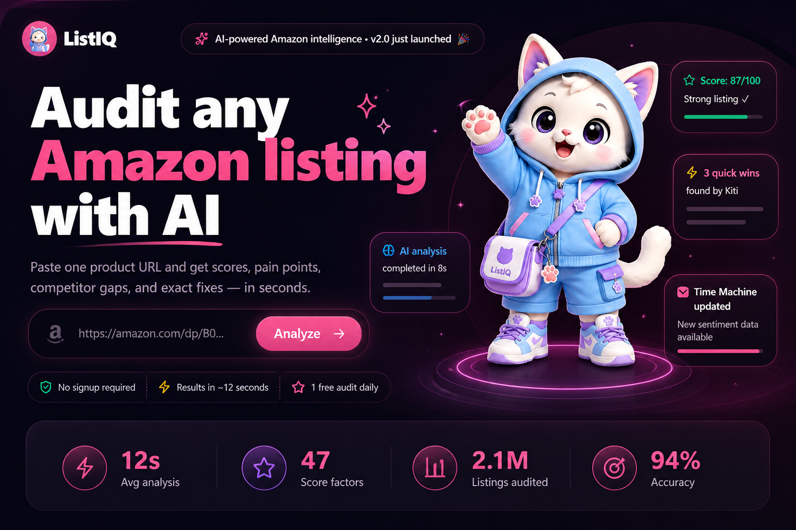
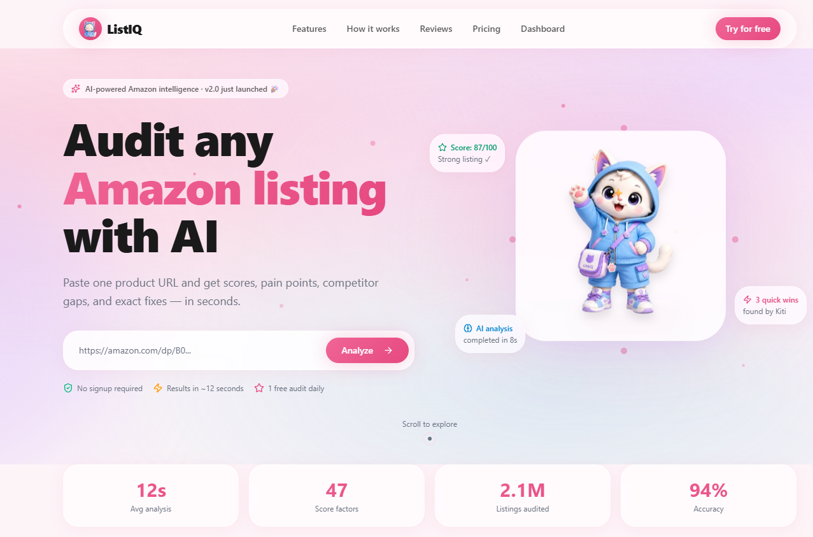
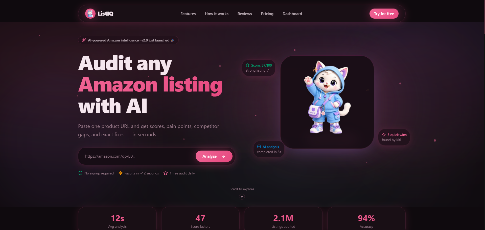
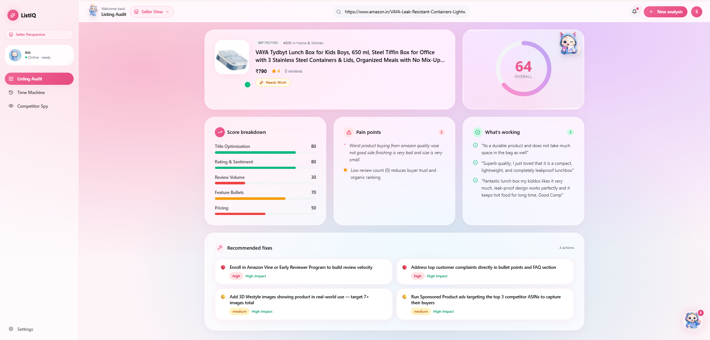
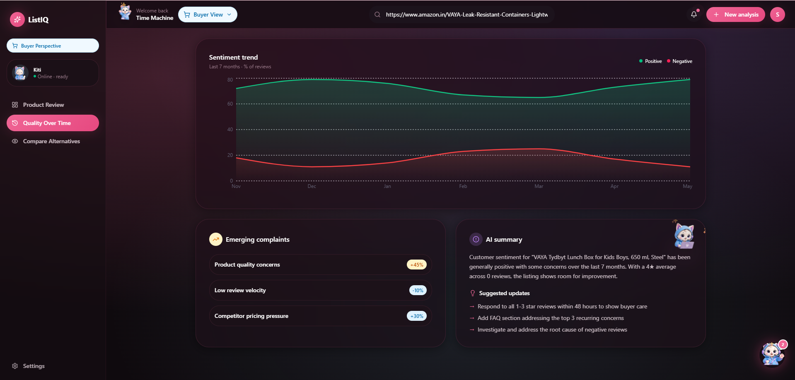
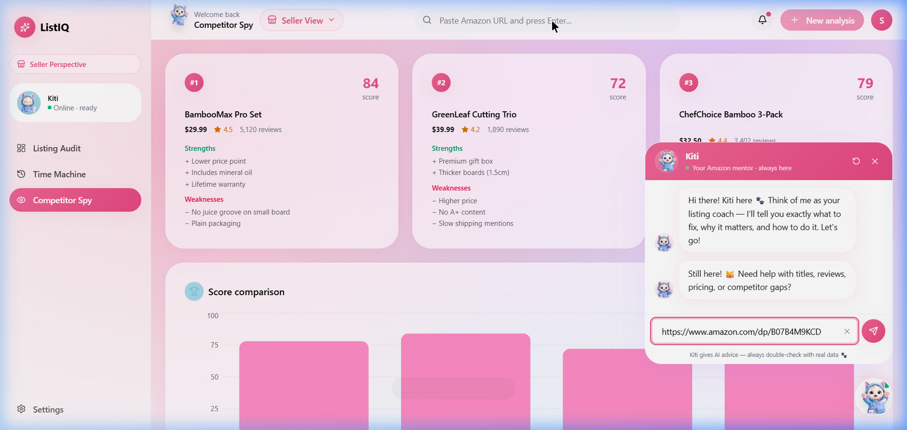

<div align="center">



<br/><br/>

# 🧠 &nbsp; L I S T I Q &nbsp; - &nbsp; I N T E L L I G E N C E

### *The Definitive Amazon Listing Intelligence Platform, Powered by AI*

<p>Paste any Amazon URL · Get an instant audit score · Uncover real buyer sentiment · Spot competitor gaps · Generate a ranked fix-plan</p>

<br/>

<a href="https://react.dev"></a>
<a href="https://www.typescriptlang.org"></a>
<a href="https://vitejs.dev"></a>
<a href="https://expressjs.com"></a>
<a href="https://tailwindcss.com"></a>
<a href="https://www.framer.com/motion/"></a>

<br/><br/>


&nbsp;

&nbsp;


</div>

---

<br/>

## 📖 Table of Contents

| | Section |
|:--|:--|
| 🌟 | [Overview](#-overview) |
| 📸 | [Showcase](#-showcase) |
| ✨ | [Core Features](#-core-features) |
| ⚡ | [How It Works](#-how-it-works) |
| 🗂️ | [Project Structure](#️-project-structure) |
| 🛠️ | [Tech Stack](#️-tech-stack) |
| 🚀 | [Getting Started](#-getting-started) |
| 🔑 | [Environment Config](#-environment-config) |
| 🔌 | [API Reference](#-api-reference) |
| 🐱 | [Kiti AI Engine](#-kiti--ai-engine) |
| 🗺️ | [Roadmap](#️-roadmap) |
| 🤝 | [Contributing](#-contributing) |

<br/>

---

## 🌟 Overview

**ListIQ - Intelligence** is a high-performance, full-stack SaaS platform built to give Amazon sellers and smart shoppers a definitive data advantage. 

In a matter of seconds, ListIQ processes live product data to evaluate a listing across **5 critical performance pillars**, extracts genuine **buyer pain points** directly from 1–2★ reviews, and generates a **data-backed, prioritized fix plan** to boost BSR and conversions. The entire experience is seamlessly guided by **Kiti** — an AI co-pilot featuring a robust 20-intent engine that demystifies everything from A9 algorithms to PPC and competitor gaps.

> **Transform raw marketplace data into actionable, revenue-driving business strategy.**

### 🎯 &nbsp; Who Is This Built For?

| Audience | The ListIQ Advantage |
|:--|:--|
| 🏪 **Amazon Sellers** | Automatically audit listings, pinpoint conversion leaks, and get a precise execution plan to outrank competitors. |
| 🛍️ **Smart Shoppers** | See through the marketing fluff. Evaluate real product flaws and aggregate review sentiments before purchasing. |
| 📈 **Brand Managers** | Monitor competitor pricing, track sentiment shifts over time, and discover untapped keyword opportunities. |
| 🎓 **E-commerce Students** | Use the built-in Kiti AI to learn advanced concepts like BSR, Vine, PPC, and the A9 Search Algorithm. |

<br/>

---

## 📸 Showcase

*Experience a premium, dynamic interface featuring glassmorphism, responsive micro-animations, and data-rich charting.*

<br/>

### 🏠 &nbsp; Landing Page

<div align="center">
<h3>🌞 Light & 🌙 Dark Mode Support</h3>


</div>

---

### 📊 &nbsp; Dynamic Seller Audit Dashboard

<div align="center">

</div>
<br/>

> *Real-time animated score rings, actionable SEO/AEO analysis, "What's Working" vs "Pain Points" review breakdowns, and AI-driven optimization execution plans in one sleek view.*

---

### ⏳ &nbsp; Time Machine — Sentiment Timeline

<div align="center">

</div>
<br/>

> *Track positive vs negative buyer perception over a 7-month window. Instantly flag emerging complaints with percentage spikes (e.g., +340% "Warping after dishwasher").*

---

### 🕵️ &nbsp; Competitor Spy

<div align="center">

</div>
<br/>

> *Side-by-side ASIN comparisons highlighting competitor pricing, review velocity, strengths, and exploitable weaknesses.*

---

### 🐱 &nbsp; Kiti AI Assistant

<div align="center">

</div>
<br/>

> *Context-aware floating AI panel. Kiti understands the specific product you're analyzing and can answer highly technical Amazon questions instantly.*

<br/>

---

## ✨ Core Features

<br/>

<table>
<tr>
<td width="50%" valign="top">

### 🔬 &nbsp; 360° Listing Audit
- **Algorithmic 0–100 Score** with animated gradient UI.
- **7 Scored Pillars**: Title, Bullets, Images, A+ Content, Sentiment, Pricing, BSR.
- **Pain Points & Praises**: Extracted directly from real buyer reviews.
- **Ranked Fix Plan**: Actionable steps sorted by immediate conversion impact.

</td>
<td width="50%" valign="top">

### 🛒 &nbsp; Dual Perspective Engine
- **Seller Mode**: Optimized for ranking, keyword gaps, and revenue simulators.
- **Buyer Mode**: Focused on product flaws, true value, and sentiment timelines.
- Seamless one-click toggle with context-aware UI transitions.

</td>
</tr>
<tr>
<td width="50%" valign="top">

### 🕵️ &nbsp; Competitor Spy
- Compare up to 3 rival ASINs side-by-side.
- Analyze rating, reviews, price, and feature gaps.
- Strengths & Weaknesses matrix for every competitor.
- Visual score comparison charts.

</td>
<td width="50%" valign="top">

### ⏳ &nbsp; Time Machine
- 7-month historical sentiment charting.
- Automatically flags emerging buyer complaints with percentage spikes.
- AI-generated root cause analysis.
- Suggested listing updates to mitigate future negative reviews.

</td>
</tr>
<tr>
<td width="50%" valign="top">

### 🐱 &nbsp; Kiti AI Co-pilot
- **20+ Built-in Intents** (BSR, PPC, A9, Vine, etc.).
- Answers are mathematically grounded in the *currently analyzed* product.
- **Robust Local Engine**: Works even without an OpenAI API key.
- Beautiful markdown rendering with interactive states.

</td>
<td width="50%" valign="top">

### 🌍 &nbsp; Global Intelligence
- **Live Data Scraping** via Rainforest API.
- **Deterministic Smart Mock Fallback**: Ensures a realistic, varied experience even when offline or out of API credits.
- Auto-detects 10 international Amazon marketplaces and local currencies.

</td>
</tr>
</table>

<br/>

---

## ⚡ How It Works

```text
  ┌──────────────────────────────────────────────────────────────┐
  │                         SYSTEM FLOW                          │
  ├──────────────────────────────────────────────────────────────┤
  │                                                              │
  │   1. Input Amazon URL  ──►  2. Intelligence Engine Fires     │
  │                                        │                     │
  │                ┌───────────────────────▼──────────────┐      │
  │                │    Live API Scraper (Rainforest)     │      │
  │                │    OR Deterministic Smart Fallback   │      │
  │                └───────────────────────┬──────────────┘      │
  │                                        │                     │
  │          ┌─────────────────────────────▼──────────────────┐  │
  │          │      Analysis Core  (AI + Heuristic Rules)     │  │
  │          │   · Metric Scoring     · Sentiment Extraction  │  │
  │          │   · Competitor Match   · SEO Gap Discovery     │  │
  │          └────────────────┬─────────────────┬─────────────┘  │
  │                           │                 │                │
  │               ┌───────────▼──────┐  ┌───────▼──────┐         │
  │               │ React Dashboard  │  │  Kiti Chat   │         │
  │               │ Responsive UI    │  │  20+ Intents │         │
  │               │ Real-Time State  │  │  Contextual  │         │
  │               └──────────────────┘  └──────────────┘         │
  └──────────────────────────────────────────────────────────────┘
```

<br/>

---

## 🗂️ Project Structure

```text
ListIQ/
│
├── 📄 start.bat                     # Quick-start dev launcher (Windows)
├── 📄 package.json                  # Root — runs client/server concurrently
│
├── 🎨 frontend/                     # React 19 · TanStack Start · Tailwind 4
│   └── src/
│       ├── routes/                  # Pages: Landing & Dashboard
│       ├── components/              # UI elements: Mascot, GlassCards, Nav
│       ├── tabs/                    # Feature modules: Audit, Spy, Time Machine
│       └── services/                # Axios API client integrations
│
└── ⚙️  backend/                      # Node.js · Express 5
    └── src/
        ├── routes/                  # Express endpoints (/analyze, /chat)
        ├── services/                # Business logic & orchestration
        ├── providers/               # External APIs: Rainforest & OpenAI
        └── config/                  # Environment & server config
```

<br/>

---

## 🛠️ Tech Stack

| Domain | Technology | Implementation Details |
|:--|:--|:--|
| **Frontend Core** | React 19 + TypeScript | Concurrent rendering, strict typing |
| **Routing** | TanStack Router | File-based, type-safe routing |
| **Styling** | Tailwind CSS v4 | Utility-first with custom CSS variables for themes |
| **Animations** | Framer Motion 12 | Complex micro-interactions, layout transitions |
| **Data Viz** | Recharts 3 | Responsive sentiment & competitor charts |
| **Backend Core** | Node.js + Express 5 | Asynchronous REST API architecture |
| **Data Fetching** | Rainforest API | High-fidelity Amazon HTML parsing |
| **AI Integration** | OpenAI API | Structured JSON response parsing for intelligent insights |

<br/>

---

## 🚀 Getting Started

### Prerequisites

- **Node.js**: v18+
- **Rainforest API Key** *(Optional - Deterministic mock data used if absent)*
- **OpenAI API Key** *(Optional - Rule-based intent engine used if absent)*

### 1. Clone & Install

```bash
git clone https://github.com/Anjali15-rawat/ListIQ--Intelligence-.git
cd ListIQ--Intelligence-

# Install root, frontend, and backend dependencies automatically
npm install
npm install --prefix frontend
npm install --prefix backend
```

### 2. Environment Configuration

Create a `.env` file in the `backend/` directory:

```env
PORT=5000
RAINFOREST_API_KEY=your_key_here      # Optional
OPENAI_API_KEY=your_key_here          # Optional
```

Create a `.env` file in the `frontend/` directory:

```env
VITE_API_URL=http://localhost:5000
```

### 3. Launch the Application

**One-Click Start (Windows):**
```bash
.\start.bat
```

**Standard Start (Mac/Linux/Windows):**
```bash
npm run dev    # Boots frontend on :5173 and backend on :5000
```

<br/>

---

## 🗺️ Roadmap

| Status | Feature |
|:--|:--|
| ✅ Done | End-to-end Listing Audit Engine |
| ✅ Done | Kiti Context-Aware AI Assistant |
| ✅ Done | Dual Perspective Toggle (Buyer vs Seller) |
| ✅ Done | Competitor Spy & Time Machine Modules |
| ✅ Done | Deterministic Smart Mock Data Fallback |
| ✅ Done | Premium Glassmorphism UI/UX Overhaul |
| 🔜 Next | User Authentication & Saved Audit History |
| 🔜 Next | Batch URL Analysis (Multi-ASIN processing) |
| 🔜 Next | One-Click PDF Export for Audit Reports |
| 🔜 Next | Chrome Extension for On-Page Amazon Audits |

<br/>

---

## 🤝 Contributing

Contributions are warmly welcome! Whether it's fixing bugs, adding new features, or improving documentation, your help makes ListIQ better.

1. Fork the Project
2. Create your Feature Branch (`git checkout -b feature/AmazingFeature`)
3. Commit your Changes (`git commit -m 'Add some AmazingFeature'`)
4. Push to the Branch (`git push origin feature/AmazingFeature`)
5. Open a Pull Request

<br/>

---

## 📄 License

This project is licensed under the **ISC License**.

<div align="center">
<i>Built with precision for Amazon sellers who refuse to guess.</i>
</div>
